##### Table of Contents:
1. [Introduction](#introduction)
1. [Hardware](#hardware)
1. [Software](#software)
1. [Setup](#setup)
1. [Algorithm and Code](#algorithm)

## Introduction:

The project, named Janus, is designed for medical applications, indicating that the cartridge contains microchannels through which various liquids, including different enzymes.

The project is inspired by the utilization of image processing and computer vision technologies to detect the presence of liquid inside a micro-sized channel in a cartridge.

The algorithm relies entirely on the [grayscale intensity level](https://i.stack.imgur.com/fdbAz.png) of each pixel in the captured frame from the camera, thus depending on the light and its intensity.

## Hardware:
- [Arduino Portenta H7 + Portenta Vision Shield - Ethernet](https://store.arduino.cc/products/portenta-h7)
- [Manual Linear Positioning Stage](https://www.amazon.co.uk/Positioning-Trimming-Micrometer-Displacement-Precision/dp/B0C4PPD2VW) for the [Cartridge](https://i.imgur.com/axXRbiQ.jpeg)

- A 3D Printed Stand/Holder for Camera
- [White LED Backlight Module](https://shop.pimoroni.com/products/white-led-backlight-module?variant=36999548170)
- [Solid Aluminum Optical Breadboards](https://www.thorlabs.com/newgrouppage9.cfm?objectgroup_id=159)
- [Black Box](https://www.plastor.co.uk/euro-stacking-containers-with-and-without-lids-folding-containers/prime-economy-range-euro-container-cases/ref-bk-case43-32-prime-economy-euro-container-cases-400-x-300-x-335mm-with-hand-holes/) for isolating the testbench
- [Push Button](https://amzn.eu/d/0aI9zJep) 
## Software:

- [OpenMV IDE](https://openmv.io/pages/download) using [MicroPython](https://micropython.org/)

## Setup:
The following images are self-explanatory regarding how the hardware was set up.

Close view| Top view| Side view
------------ | -------------| -------------
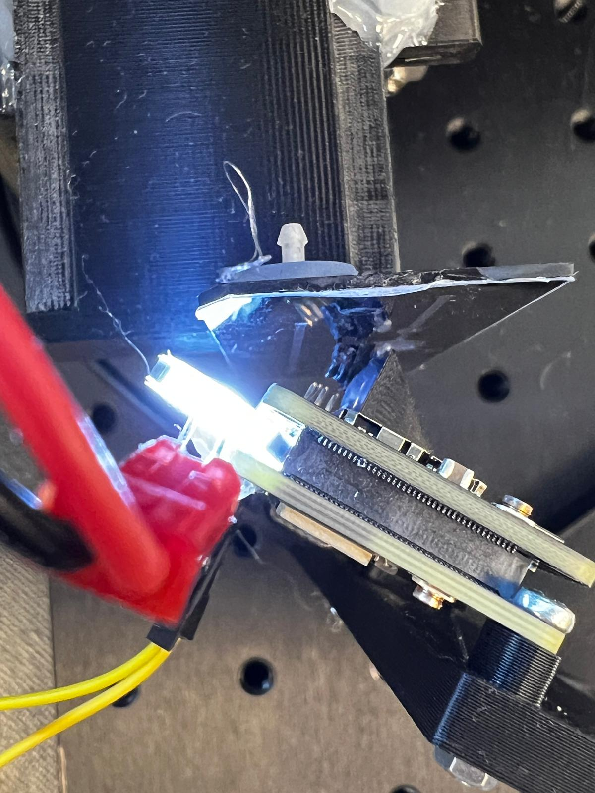| 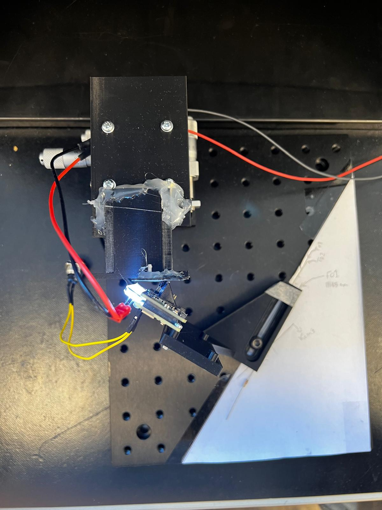| 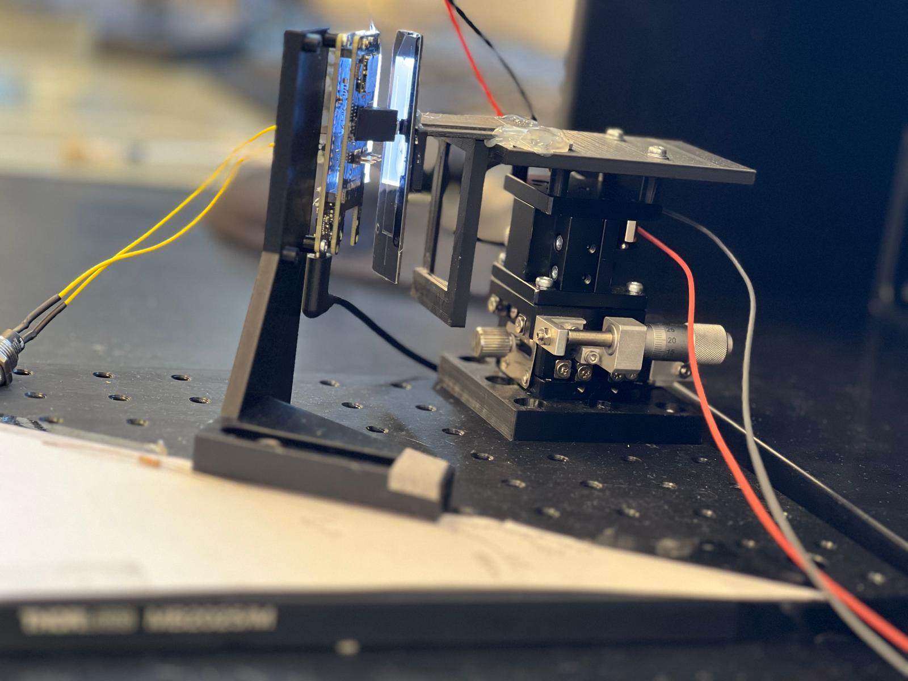

Constraints: 

The project is focused on the straight channel in the cartridge. The camera is limited to capture the channel in a straight and vertical orientation, and the lens should be aligned so the channel appears straight and vertical almost completely. In addition, virtual lens correction was added in the code in order to achieve that, as shown in the following.

Before Correction| After Correction
------------ | -------------
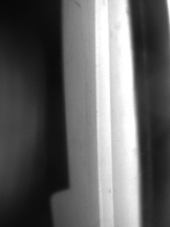| 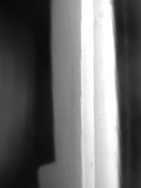

The light intensity reflected on the Channel to the Camera was not unified as shown in the previous figure, so lighting equalization was needed through historgram equalization as follow with a sharpening filter to show the edges of the cartridge.

Before filters | After filters
------------ | -------------
 | 

## Algorithm:

Initially, the liquid detection via the grayscale intensity is based on the greyscale intensity level, ranging from 0 to 255, where 0 is black and 255 is white.

After observing, when the channel is empty, the edges as well as the middle of channel are high value in the grayscale intensity level (white). Conversely, when it is full, it is significantly low value/darker (black).

The algorithm leverages this to detect whether the channel contains liquids.

The first objective was to detect straight lines in the cartridge to detect the location of the channel. The technique that was used is [Hough Line Transform](https://docs.openmv.io/library/omv.image.html).

<figure style="display: flex; flex-direction: column; align-items: center; justify-content: center; height: 45vh;">
        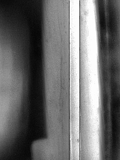
        <figcaption>Detected lines</figcaption>
    </figure>
In the previous, only two straight lines were detected ( the edges ).

Subsequently, from the data, calculate the maximum horizontal and vertical as well as minimum of pixels of the detected lines (assuming that the lines detected the channel), which are the corner positions of the channel leading to form a bounding box around the channel.

<figure style="display: flex; flex-direction: column; align-items: center; justify-content: center; height: 45vh;">
        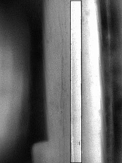
        <figcaption>Bounding box </figcaption>
    </figure>

The same will be applied to a "reference segment" which is out of the channel, the cartridge background. This will act as our refrence threshold to detect whether the channel is full or empty depending on the gradient level. The cartridge background is grey and falls around 125 units depending on the light intensity of the environment.

<figure style="display: flex; flex-direction: column; align-items: center; justify-content: center; height: 45vh;">
        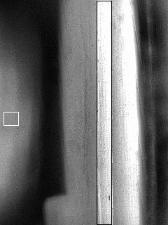
        <figcaption>Reference Rectangle </figcaption>
    </figure>

Now, as the channel is detected, it is split into segments along the frame's height. For each segment of the channel, the mean value of its grayscale intensity will be extracted and stored in an array. The following figure shows the segments lines of the channel.

<figure style="display: flex; flex-direction: column; align-items: center; justify-content: center; height: 45vh;">
        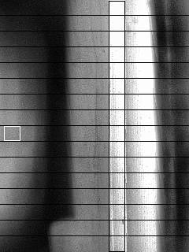
        <figcaption>Segment Lines in the channel </figcaption>
    </figure>

Now, we have an array of the mean values of each segment in the channel as well as the mean value of the reference rectangle that we created.

By dividing the array by the reference rectangle, we normalize the segment values based on the reference rectangle, then store them in an array.

The following is the observation on the values when it is empty as well as full:

<figure style="display: flex; flex-direction: column; align-items: center; justify-content: center; height: 55vh;">
        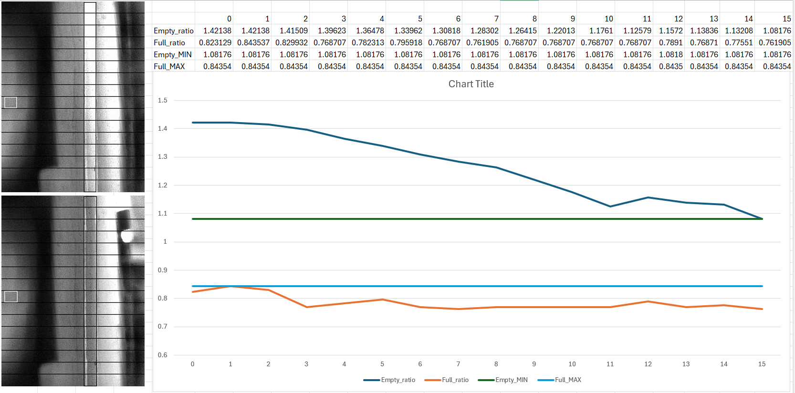
        <figcaption>Analysis (Empty vs Full) channels </figcaption>
    </figure>

As shown in the previous figure, it could be observed that there is a gap when the channel is empty compared to when it is full.

In the Empty_ratio values, the reason why the value is higher in the upper segments in comparison to lower segments is because of the placement of the light source (The LED panel). The following picture shows why it illuminates the top region of the channel more than it does to the bottom region of the channel.

<figure style="display: flex; flex-direction: column; align-items: center; justify-content: center; height: 50vh;">
        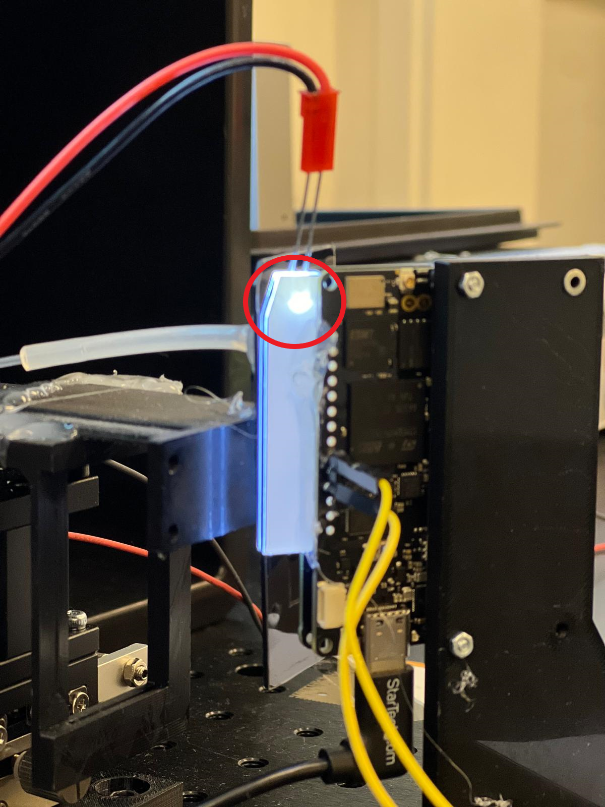
        <figcaption>LED Panel</figcaption>
    </figure>

Based on this observation and the data shown in the previous graph, a manual threshold value around 1.0 was set for the liquid detection.

The last comparison is made to detect the liquid based on the previous. To see whether the normalized segment value is above 1.3 or below.

Below are examples of pictures captured from the a video feed.

Empty | Full| Hybrid 1| Hybrid 2
------------ | -------------| -------------| -------------
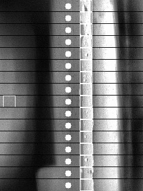 | 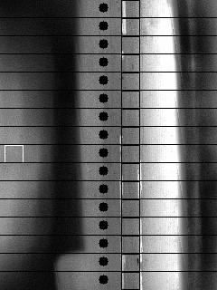| 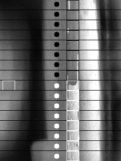| 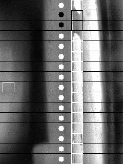

The push button's functionality is resetting the appliciton,that it in case of any drastic changes.
