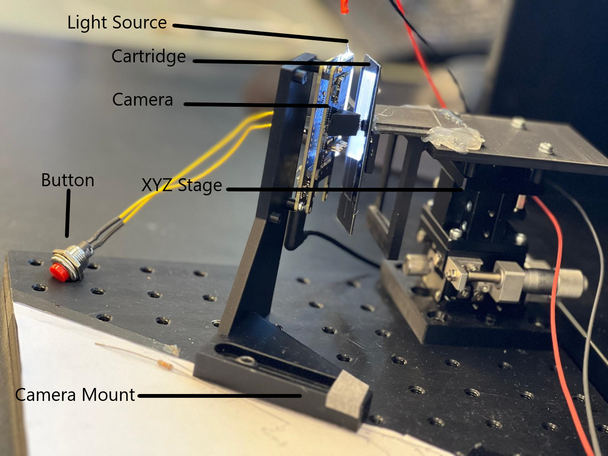

##### Table of Contents:
1. [Introduction](#introduction)
1. [Hardware](#hardware)
1. [Software](#software)
1. [Setup](#setup)
1. [Algorithm and Code](#algorithm)

## Introduction:

The project, Janus, is designed for detecting the presence of liquid in a medical application. In this setup, a cartridge contains microchannels through which various liquids, including different enzymes, flow. 

The project is inspired by the use of image processing and computer vision technologies to detect the presence of liquid inside a micro-sized channel in a cartridge.

The algorithm relies entirely on the [grayscale intensity levels](https://i.stack.imgur.com/fdbAz.png) of each pixel in the captured frame from the camera, thus depending on the light and its intensity.

## Hardware:
- [Arduino Portenta H7 + Portenta Vision Shield - Ethernet](https://store.arduino.cc/products/portenta-h7)
- [Manual Linear Positioning Stage](https://www.amazon.co.uk/Positioning-Trimming-Micrometer-Displacement-Precision/dp/B0C4PPD2VW) for the [Cartridge](https://i.imgur.com/axXRbiQ.jpeg)

- A 3D Printed Stand/Holder for Camera
- [White LED Backlight Module](https://shop.pimoroni.com/products/white-led-backlight-module?variant=36999548170)
- [Solid Aluminum Optical Breadboards](https://www.thorlabs.com/newgrouppage9.cfm?objectgroup_id=159)
- [Black Box](https://www.plastor.co.uk/euro-stacking-containers-with-and-without-lids-folding-containers/prime-economy-range-euro-container-cases/ref-bk-case43-32-prime-economy-euro-container-cases-400-x-300-x-335mm-with-hand-holes/) for isolating the testbench
- [Push Button](https://amzn.eu/d/0aI9zJep) 
## Software:

- [OpenMV IDE](https://openmv.io/pages/download) using [MicroPython](https://micropython.org/)

## Setup:
The following images are self-explanatory and show how the hardware was set up.

<figure style="display: flex; flex-direction: column; align-items: center; justify-content: center; height: 60vh;">
        
        <figcaption>Setup</figcaption>
    </figure>

Close view| Top view| Side view
------------ | -------------| -------------
| | 

Constraints: 

The project focuses on the straight channel in the cartridge. The camera is limited to capture the channel in a straight and vertical orientation, and the lens should be aligned so the channel appears straight and vertical almost completely. Additionally, virtual lens correction was applied in the code to achieve this, as shown below.

Before Correction| After Correction
------------ | -------------
| 

The light intensity reflected from the channel to the camera was not uniform, as shown in the previous figure. Therefore, lighting equalization was needed, using histogram equalization followed by a sharpening filter to highlight the edges of the cartridge.

Before filters | After filters
------------ | -------------
 | 

## Algorithm:

Initially, liquid detection is based on the grayscale intensity level, which ranges from 0 to 255, where 0 is black and 255 is white

When the channel is empty, the edges and the middle of the channel have high values in the grayscale intensity level (white). Conversely, when the channel is full, the grayscale intensity level is significantly lower (darker).

The algorithm leverages this to detect whether the channel contains liquids.

The first objective was to detect straight lines in the cartridge to detect the location of the channel. The technique that was used is [Hough Line Transform](https://docs.openmv.io/library/omv.image.html).

<figure style="display: flex; flex-direction: column; align-items: center; justify-content: center; height: 45vh;">
        
        <figcaption>Detected lines</figcaption>
    </figure>
In the previous, only two straight lines were detected ( the edges ).

Subsequently, the maximum and minimum pixel values of the detected lines are calculated from the data, assuming that these lines represent the channel edges. These values define the corner positions of the channel, forming a bounding box around it.

<figure style="display: flex; flex-direction: column; align-items: center; justify-content: center; height: 45vh;">
        
        <figcaption>Bounding box </figcaption>
    </figure>

The same approach is applied to a 'reference segment' outside the channel, on the cartridge background. This segment will serve as our reference threshold to determine whether the channel is full or empty based on the gradient level. The cartridge background is gray and typically measures around 125 units depending on the ambient light intensity.

<figure style="display: flex; flex-direction: column; align-items: center; justify-content: center; height: 45vh;">
        
        <figcaption>Reference Rectangle </figcaption>
    </figure>

Once the channel is detected, it is divided into segments along the frame's height. For each segment, the mean grayscale intensity is calculated and stored in an array
The following figure shows the segment lines of the channel.

<figure style="display: flex; flex-direction: column; align-items: center; justify-content: center; height: 45vh;">
        
        <figcaption>Segment Lines in the channel </figcaption>
    </figure>

Now, we have an array of the mean values of each segment in the channel as well as the mean value of the reference rectangle that we created.

The segment values are normalized by dividing them by the reference rectangle's values, and the results are stored in an array

The following observations show the values when the channel is empty compared to when it is full.

<figure style="display: flex; flex-direction: column; align-items: center; justify-content: center; height: 55vh;">
        
        <figcaption>Analysis (Empty vs Full) channel </figcaption>
    </figure>

As shown in the previous figure, there is a noticeable difference in the grayscale values when the channel is empty compared to when it is full. In the Empty ratio values, the reason the values are higher in the upper segments compared to lower segments is due to the placement of the light source (The LED panel). 

The following picture shows why the LED panel illuminates the top region of the channel more than the bottom region.

<figure style="display: flex; flex-direction: column; align-items: center; justify-content: center; height: 50vh;">
        
        <figcaption>LED Panel</figcaption>
    </figure>

Based on this observation and the data shown in the previous graph, a manual threshold value around 1.0 was set for the liquid detection.

The final comparison determines the presence of liquid based on the previous observations, checking whether the normalized segment values are above or below 1.3

Below are examples of images captured from the video feed."

Empty | Full| Hybrid 1| Hybrid 2
------------ | -------------| -------------| -------------
 | | | 

The push button's functionality is to reset the application in case of any drastic changes.